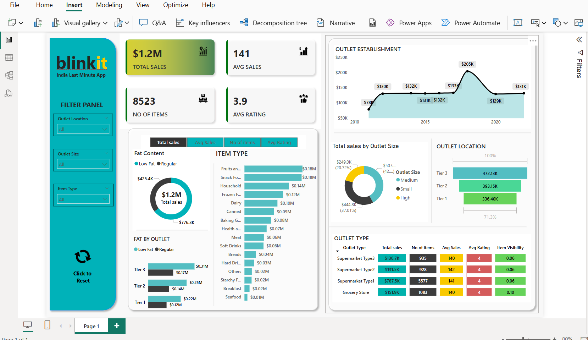

# 🛒 Blinkit Grocery Sales Analysis Dashboard 📊

This project involves analyzing Blinkit’s grocery sales data using Power BI. The goal is to extract actionable insights from retail performance data across different cities, categories, and time periods.

## 📌 Project Overview

The Blinkit Sales Analysis dashboard helps understand how the business is performing and provides key insights such as:
- Top-performing cities and product categories  
- Sales vs. profit breakdown  
- Daily and monthly trends  
- Customer purchase behavior over time

## 📈 Key Features

✅ Dynamic KPI cards for Sales, Profit, Orders  
✅ Visual breakdowns by City, Category, and Sub-Category  
✅ Time-series analysis for monthly/daily sales  
✅ Slicers and filters for deep-dive analysis  
✅ Clean, interactive interface built in Power BI

## 🧰 Tools & Technologies

- **Power BI** – Visualization and report building  
- **Excel / CSV** – Data cleaning and integration  
- **DAX** – Used for creating calculated columns and custom measures  
- **Power Query** – For transforming and loading data

## 🔍 Insights Generated

- Identified most profitable cities and product categories  
- Found high-demand seasons/months using time analysis  
- Analyzed profit leakage across sub-categories  
- Enabled data-driven decisions with visual storytelling

## 📊 Dashboard Preview

## 🚀 Future Improvements

- Add customer segmentation for targeted insights  
- Integrate live data sources using APIs or cloud storage  
- Predictive analytics for inventory or demand planning

#PowerBI #Blinkit #SalesAnalysis #Dashboard #DataAnalytics #RetailAnalytics #PortfolioProject
